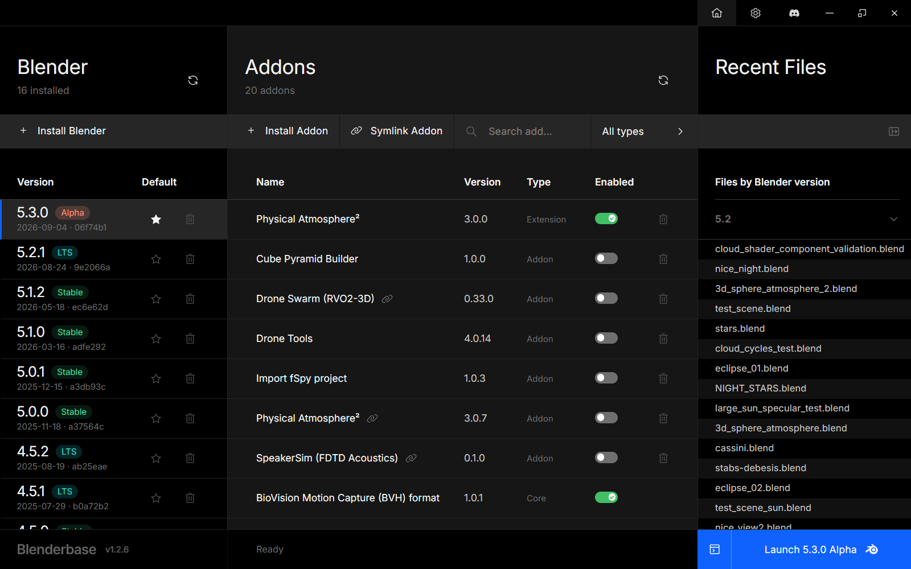

# Blenderbase

[Download](https://github.com/PhysicalAddons/blenderbase-public/releases/latest) | [Changelog](CHANGELOG.md) | [Documentation](https://github.com/PhysicalAddons/blenderbase-public/wiki) | [Get Help](https://discord.com/invite/4pseCn9pys)

Blenderbase is a free desktop app that manages your Blender installations, their addons and your recent `.blend` files from one window. Install any stable, LTS, daily or patch build of Blender, switch between versions, enable or disable addons without opening Blender, and launch the right version for the right file. It was first built as an internal tool for the [Physical Addons](https://www.physicaladdons.com) team and has proven useful for everyday Blender work as well.



Blenderbase runs on **Windows 10/11**, **macOS (Apple Silicon)** and **Linux**. It is built with the Tauri framework: a Rust backend and a small web front end, so the app is fast, lightweight and native on every platform. For work inside a Blender instance it drives Blender headlessly through Python and `bpy`.

## What it does

**Blender versions**
- Lists every Blender version found in your installation locations, with its build date, commit hash and release cycle (Stable, LTS, Alpha, Beta, Release Candidate).
- Downloads and installs portable builds from the Blender Foundation: Stable and LTS releases, Daily builds and Patch builds, with search. Every archive is checked against its published SHA-256 before it is unpacked.
- Proposes a default install folder on the first download and lets you pick another: `C:\blenderbaseapps` on Windows, `~/Applications/Blenderbase` on macOS, `~/.local/share/blenderbase/apps` on Linux. Any number of locations can be registered, including folders with versions you installed yourself.
- Registers Blender versions that are already installed (`3.0` and newer), so existing installs are managed alongside downloaded ones.
- Marks one version as the default, uninstalls versions, and opens a version's folder in Explorer or Finder from the right-click menu.
- Launches the selected version, optionally **with its console** for Python output and script errors: a terminal segment on the Launch button turns it on, and the choice is remembered.

**Addons**
- Lists the addons and extensions of the selected Blender version with their version, type (Addon, Extension, Core) and enabled state.
- Enables or disables addons outside a running Blender instance.
- Installs addons from a `.zip` or a `.py`, and uninstalls them.
- Links a development folder in place (symlink), so an addon under development stays in your project folder. On Windows this asks for administrator rights when needed.
- Opens an addon's folder from the right-click menu.

**Recent files**
- Lists the `.blend` files recently opened in each Blender version.
- Opens a file in any installed Blender version, as long as that version can read it.
- Reveals a file in Explorer or Finder from the right-click menu.

**App**
- Keeps its lists current: installed versions are rescanned when the window regains focus, and a version's addons are re-read after you launched it from Blenderbase. Both are also in the lists' right-click menus.
- Updates itself: Blenderbase checks GitHub Releases on launch and offers new versions; **Check for updates** in Settings does the same on demand.
- Settings open in the middle column of the main window: installation locations, minimise-on-launch, update checks and the light/dark/system theme.
- Recovers from a damaged database: the file is set aside and a fresh one is created, and installed versions are found again by rescanning.

## How it works

Blenderbase keeps a local SQLite database, generated on first start, with the metadata it needs: installed Blender versions, their addons, recent `.blend` files and the list of downloadable builds. The name comes from `Blender` + `database`. Nothing is sent anywhere; the only network requests are the Blender Foundation download pages, the downloads themselves and the GitHub Releases check for updates.

Downloadable builds are read from:
- https://ftp.nluug.nl/pub/graphics/blender/release/ (Stable and LTS, the European mirror)
- https://builder.blender.org/download/daily/
- https://builder.blender.org/download/patch/

Only versions from `3.1` onwards are listed, to keep the load on Blender Foundation servers small.

## Installing

Download the installer for your platform from the [latest release](https://github.com/PhysicalAddons/blenderbase-public/releases/latest):

| Platform | File |
| --- | --- |
| Windows 10/11 (x64) | `Blenderbase_x.y.z_x64_en-US.msi` |
| macOS (Apple Silicon) | `Blenderbase_x.y.z_aarch64.dmg` |
| Linux (x64) | `Blenderbase_x.y.z_amd64.AppImage` |

The Windows installer and executable are signed by SIA Physical Software through Azure Artifact Signing. SmartScreen may still show a prompt on first run until the publisher has built up reputation. The macOS app in releases after 1.2.8 is signed with the Developer ID of Physical Software SIA and notarized by Apple, so it opens like any downloaded app. 1.2.8 and older are unsigned; for those, clear the quarantine flag once after copying the app to Applications:

```
xattr -dr com.apple.quarantine /Applications/Blenderbase.app
```

Installs of 1.2.0 or newer update themselves. Older installs (1.1.0 and 1.0.x) have to be replaced by hand once; see the [1.2.0 notes](CHANGELOG.md#120).

## Building from source

Prerequisites:
- Rust (stable, via [rustup](https://rustup.rs/))
- Node.js 20.19+ (24 recommended; see `.nvmrc`)
- Windows: Visual Studio 2022 C++ Build Tools and the WebView2 runtime (preinstalled on Windows 10/11)
- macOS: Xcode command line tools
- Linux: the [Tauri prerequisites](https://tauri.app/start/prerequisites/) for your distribution

```
npm ci
npm run tauri dev
```

Set these environment variables before building:
- `SQLX_OFFLINE=true` - compiles the SQL queries against the checked-in `.sqlx` metadata instead of a live database
- `IBM_TELEMETRY_DISABLED=true` - opts out of the Carbon Design System install-time telemetry

If the checkout lives in a synced folder (Dropbox, OneDrive), point `CARGO_TARGET_DIR` and `VITE_CACHE_DIR` at a folder outside it, otherwise the sync client can lock build artifacts mid-write and break the build.

Releases are built by GitHub Actions from a `v*` tag; the release notes are the matching section of [CHANGELOG.md](CHANGELOG.md). The Windows build is code-signed there through Azure Artifact Signing (`scripts/sign-windows.ps1`, wired into Tauri by `scripts/sign-config.ps1`); local builds are unsigned unless you pass that overlay and are logged in with `az login` under an identity that holds the Certificate Profile Signer role. The macOS build is signed with a Developer ID Application certificate and notarized with an App Store Connect API key, both repository secrets prepared on the runner by `scripts/apple-signing.sh`; without them (a fork, say) it builds unsigned. `scripts/apple-certificate.sh` makes the certificate request and the `.p12` without a Mac. The **Sign check** workflow exercises both signing paths on their own.

## Notice

Blenderbase is the property of Physical Addons and has no legal binding to the Blender Foundation. There is no formal agreement between Physical Addons and the Blender Foundation regarding the use of their online resources; all Blender Foundation resources are used in good faith and with care, so as not to strain, slow down or misuse the official and mirror download pages.

Blenderbase is free to use in any project involving Blender, addon development or Blender project management, whether for hobby, educational or commercial purposes.
